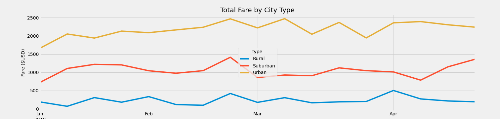

# PyBer_Analysis

## Overview of the analysis:

In the new analysis we had to create a summary DataFrame of the ride-sharing data by city type by using Python skills and knowledge of Pandas. Then, using Pandas and Matplotlib, we need to create a multiple-line graph that shows the total weekly fares for each city type. Finally, we need to submit a written report that summarizes how the data differs by city type and how those differences can be used by decision-makers at PyBer.

## Results:

First, using a groupby() function, we had to create a new DataFrames to calculate the following:

- the total number of rides by city type,
- total number of drivers for each city type,
- total amount of fares for each city type,
- average fare per ride for each city type,
- average fare per driver for each city type.

After that we could create a summary DataFrame using all the values we got from previous steps and do formatting.

And finally, we could create a multiple-line chart.

According to our DataFrame and line chart, rural cities have the fewest drivers and riders, but their average fare per ride and per driver is higher than that of other city types, indicating that they make the longest trips. However, further analysis of this data is required.
Urban cities received the most total rides, drivers, and fares overall, but their average fare per ride and driver is the lowest of all the city types, indicating that they likely have a lot of short trips.

## Summary:

According to our analysis I would provide three business recommendations to the CEO for addressing any disparities among the city types:

- More drivers should be hired for rural cities, and more advertisements should be produced to advertise the business there.
- In February, when there were the most rides and fares, suburban cities might use advertising such as referral bonuses to get more clients during the next couple months.
